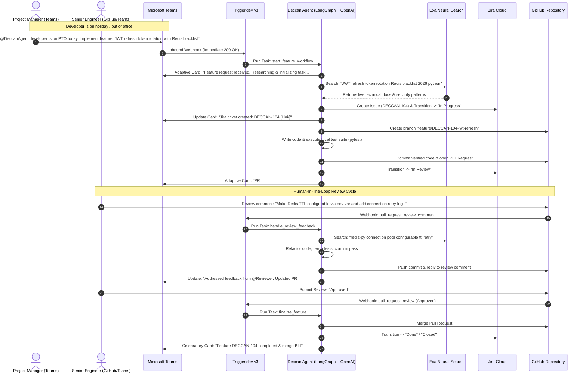
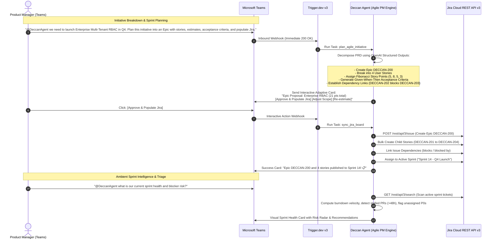

# Deccan Agents: An Agent for All
## Autonomous Software Engineer & Agile Project Manager Coworker in Microsoft Teams

> **Event:** OpenAI & AI Tinkerers Global Hackathon (Build Date: September 12, 2026)  
> **Team Name:** Deccan Agents  
> **Vision:** *"An Agent for All — From Planning Epics to Merging Pull Requests"*  
> **Target Awards:** 🥇 Global 1st Place (Mac mini + $10k OpenAI Credits) + 🎧 Best Use of CopilotKit (AirPods Max) + 🔍 Exa AI Excellence ($1k Credits)

---

## 1. Executive Summary & Thesis

### The Dual Friction of Modern Software Teams
In fast-moving software organizations, delivery bottlenecks occur on **two distinct fronts**:
1. **Engineering Bottlenecks (Developer Out of Office / Deep Work):** When an engineer is on holiday or on PTO, sprint velocity grinds to a halt. Urgent feature requests from product managers or critical patches sit idle in chat channels waiting for an engineer's return, or force engineers to interrupt their time off.
2. **Project Management Bottlenecks (Backlog Friction & Agile Overhead):** Product managers and team leads waste hours manually converting conversational initiatives into Jira Epics, writing boilerplate user stories, manually assigning story points, linking dependency graphs, and chasing sprint burndown statuses across admin dashboards.

### The Solution: "An Agent for All"
**Deccan Agent** is a unified, autonomous AI coworker living natively inside **Microsoft Teams**, integrated deeply with **GitHub** and **Atlassian Jira Cloud**. It serves both sides of the modern software team:
- **As an Autonomous Software Engineer:** It accepts feature specifications in Teams, plans architecture, researches current 2026 APIs with **Exa Neural Search**, creates tracking issues in Jira, writes code, runs local unit tests (`pytest`), opens GitHub Pull Requests, and actively addresses code review comments in an iterative feedback loop until approved.
- **As an Autonomous Agile Project Manager:** It accepts high-level conversational initiatives in Teams, creates structured Epics in Jira, decomposes them into technical user stories with Given-When-Then acceptance criteria, assigns Fibonacci story point estimates, links cross-ticket dependencies, plans sprints, and delivers real-time sprint health diagnostics.

---

## 2. Sponsor Integration Matrix

| Sponsor | Technology Used | Project Integration & Value | Hackathon Award Targeted |
| :--- | :--- | :--- | :--- |
| **OpenAI (Marquee Sponsor)** | `gpt-4o` + Structured Outputs (`client.beta.chat.completions.parse`) | Powers reasoning across both modes: code synthesis & test generation (Scenario 1) and Epic decomposition, acceptance criteria writing & story point estimation (Scenario 2). | 🥇 **1st Place Overall** ($10,000 credits + Mac minis) |
| **Trigger.dev v3 (Sponsor)** | Durable Serverless Workflows | Webhook ingestion for Teams & GitHub with instant `<1s` HTTP ACKs to prevent 5s timeouts; coordinates multi-step long-running agent execution durably. | Enterprise Reliability & Async Harness |
| **Exa AI (Sponsor)** | Neural Search API (`exa-py`) | Queries live technical documentation (`exa.search(query, type="neural", num_results=2)`) before coding or during review refactoring to ground implementations in verified 2026 specifications. | 🔍 **Exa Sponsor Award** ($1,000 credits) |
| **CopilotKit (Sponsor)** | In-App Coworker SDK | Powers an accompanying web-based Coworker Cockpit using `useCopilotReadable` (live Jira/GitHub state) and `useCopilotAction` (manual triggers & overrides). | 🎧 **Best Use of CopilotKit** (AirPods Max) |
| **Model Context Protocol** | FastMCP (`mcp[cli]`) | Standardized tool server exposing Jira, GitHub, Teams, and Exa tools over stdio JSON-RPC with strict `stderr` diagnostic logging. | Protocol Standardization |
| **LangGraph & LangSmith** | Cyclic StateGraph & Tracing Waterfall | Coordinates multi-step reasoning, human-in-the-loop review iterations, and LangSmith observability waterfall traces. | Rigor & Observability |

---

## 3. Core Scenario 1: The Autonomous Stand-in Developer (Holiday Mode)



---

## 4. Core Scenario 2: The Autonomous Agile Project Manager ("An Agent for All")



### Scenario 2 Feature Highlights
1. **Intelligent Epic & Story Decomposition:** Converts freeform conversational product goals into rigorous Agile artifacts complete with technical acceptance criteria.
2. **Defensive Story Point Estimation:** Evaluates implementation complexity across database, middleware, frontend, and test surfaces using Fibonacci scoring.
3. **Automated Dependency Mapping:** Configures Jira issue links (`blocks`, `is blocked by`, `relates to`) so delivery leads can identify critical path bottlenecks immediately.
4. **Interactive Teams Adaptive Cards:** Gives humans full control with 1-click execution or scope adjustments directly inside the conversation thread.
5. **Sprint Health Radar:** Scans active sprint issues to flag stalled tickets, overdue code reviews, and unassigned high-priority bugs without forcing PMs to build custom Jira dashboards.

---

## 5. Technical Architecture & File Layout

```
openai-global/
├── server.py                   # FastAPI + Trigger.dev webhook receiver & FastMCP server
├── pyproject.toml              # Modern dependencies managed via uv
├── .env.example                # Secrets schema for Teams, Jira, GitHub, OpenAI, Exa
├── .gitignore                  # Clean exclusions (.env, node_modules, cache)
├── mock_data.json              # Realistic offline test fixtures for zero-fail demos
├── src/
│   ├── agent/
│   │   ├── state.py            # LangGraph TypedDict state schema (Dev + PM modes)
│   │   ├── nodes_dev.py        # Scenario 1: Developer nodes (Code, Test, PR, Review)
│   │   ├── nodes_pm.py         # Scenario 2: Project Manager nodes (Epic, Stories, Sprint)
│   │   └── graph.py            # Unified StateGraph routing between Dev & PM workflows
│   └── tools/
│       ├── exa_client.py       # Exa neural documentation search
│       ├── jira_client.py      # Jira Cloud client (Epics, Stories, Sprints, Transitions)
│       ├── github_client.py    # GitHub API & git CLI operator (Branches, PRs, Reviews)
│       └── teams_client.py     # Microsoft Teams Adaptive Cards client
├── tests/
│   ├── test_dev_workflow.py    # Unit & integration tests for Scenario 1
│   └── test_pm_workflow.py     # Unit & integration tests for Scenario 2
├── .agents/
│   └── skills/                 # High-impact skills (Exa, MCP, LangGraph, Protocol, etc.)
├── EXECUTION_LOG.md            # Live audit trail
├── README.md                   # Project overview & quickstart
└── DECCAN_AGENTS_PLAN.md       # This comprehensive specification
```

---

## 6. Judging Rubric Alignment: Path to 5/5

| Criterion | What Judges Look For | How Deccan Agents Guarantees Score 5/5 |
| :--- | :--- | :--- |
| **1. Core Requirements & Functionality** | Fully working, robust agent inside native environment. | **Complete Bidirectional Loops:** Scenario 1 implements code, runs unit tests, opens PRs, and handles review comments. Scenario 2 creates Epics, stories, and dependencies in Jira. Dual-mode mock guarantees 100% demo uptime. |
| **2. Innovation & Theme Alignment** | *"Agents leaving the chatbox... place where people already work."* | **"An Agent for All":** Lives where work actually happens (Microsoft Teams, GitHub, Jira). Eliminates context switching for both engineers and project managers. |
| **3. Technical Execution & Integration** | Code quality, orchestration, failure handling, architecture. | **Production Architecture:** Built with **LangGraph** (StateGraph with cyclic review loop), **Trigger.dev v3** (durable serverless webhook dispatching), **OpenAI Structured Outputs**, **Exa Neural Grounding**, and **FastMCP stdio JSON-RPC**. |
| **4. Usefulness & Agentic Experience** | Creates substantial value, native feel, clear user control. | **Human-in-the-Loop:** Doesn't blindly push or populate; provides interactive Teams Adaptive Cards for approval, responds to human PR review feedback, and verifies all code with test suites. |
