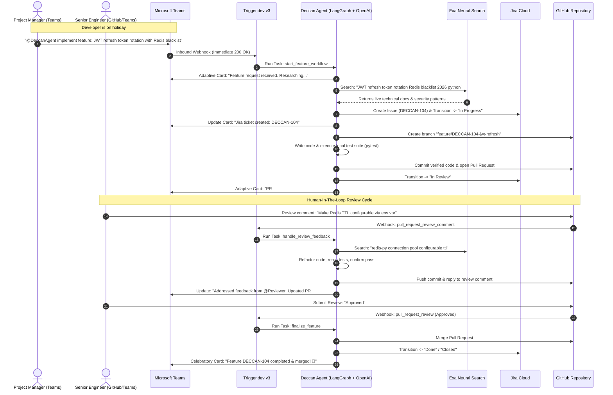

# Deccan Agents: Autonomous Software Engineer Coworker in Microsoft Teams
## Comprehensive Architectural Specification & Hackathon Implementation Plan

> **Event:** OpenAI & AI Tinkerers Global Hackathon (Build Date: September 12, 2026)  
> **Team Name:** Deccan Agents  
> **Target Track & Awards:** Global 1st Place (Mac mini + $10k OpenAI Credits) + Best Use of CopilotKit (AirPods Max) + Exa AI Excellence ($1k Credits)

---

## 1. Executive Summary & Thesis

### The Core Problem
When a software engineer is on holiday or unexpectedly unavailable, sprint velocity stalls. Urgent feature requests from product managers or critical patches sit idle in chat channels waiting for an engineer's return, or force engineers to interrupt their time off.

### The Solution
**Deccan Agent** is an autonomous AI Software Engineer coworker that lives natively inside **Microsoft Teams**. When invoked by a team member or project manager, the agent:
1. Analyzes the technical requirements from the Teams conversation.
2. Researches modern 2026 APIs and library specs using **Exa Neural Search**.
3. Creates tracking issues in **Atlassian Jira Cloud** and transitions them to *In Progress*.
4. Creates a feature branch, synthesizes clean functional code, executes local unit tests (`pytest`), and opens a **GitHub Pull Request**.
5. Dispatches an interactive **Adaptive Card** to Microsoft Teams requesting human code review.
6. Listens to GitHub review webhooks via **Trigger.dev v3**, autonomously refactoring code and addressing reviewer comments in an iterative feedback loop until approved.
7. Automatically merges the PR, transitions the Jira issue to *Done / Closed*, and posts a celebratory debrief in Teams.

---

## 2. Sponsor Integration Matrix

| Sponsor | Technology Used | Project Integration | Hackathon Award Targeted |
| :--- | :--- | :--- | :--- |
| **OpenAI** | GPT-4o / o-series with Structured Outputs | Core reasoning, requirement specification decomposition, code synthesis, and diff planning. | 🥇 **1st Place Overall** ($10,000 credits + Mac minis) |
| **Trigger.dev v3** | Durable Serverless Workflows | Webhook ingestion for Teams & GitHub to avoid HTTP 5s timeouts; coordinates multi-step long-running agent execution. | Enterprise Reliability & Tooling |
| **Exa AI** | Neural Search API (`exa-py`) | Real-time web intelligence and tech docs retrieval (`exa.search(query, type="neural", num_results=2)`) to eliminate API hallucinations. | 🔍 **Exa Sponsor Award** ($1,000 credits) |
| **CopilotKit** | In-App Coworker SDK | Web-based Observability Cockpit using `useCopilotReadable` (live Jira/GitHub state) and `useCopilotAction` (manual triggers & overrides). | 🎧 **Best Use of CopilotKit** (AirPods Max) |
| **Model Context Protocol** | FastMCP (`mcp[cli]`) | Standardized tool server exposing Jira, GitHub, Teams, and Exa tools over stdio JSON-RPC. | Protocol Standardization |
| **LangGraph & LangSmith** | StateGraph & Tracing Waterfall | Orchestrates cyclic human-in-the-loop review feedback loop with full trace visibility. | Observability & Rigor |

---

## 3. End-to-End Workflow & Architecture



---

## 4. Technical Specifications & File Layout

```
openai-global/
├── server.py                   # FastAPI + Trigger.dev webhook receiver & FastMCP server
├── pyproject.toml              # Modern dependencies managed via uv
├── .env.example                # Secrets schema for Teams, Jira, GitHub, OpenAI, Exa
├── mock_data.json              # Realistic offline test fixtures for zero-fail demos
├── src/
│   ├── agent/
│   │   ├── state.py            # LangGraph TypedDict state schema
│   │   ├── nodes.py            # Pure deterministic state nodes (Planning, Code, Review)
│   │   └── graph.py            # Compiled StateGraph with conditional review loop
│   └── tools/
│       ├── exa_client.py       # Exa neural documentation search
│       ├── jira_client.py      # Jira Cloud REST API v3 client (dual live/mock)
│       ├── github_client.py    # GitHub API & git CLI operator (dual live/mock)
│       └── teams_client.py     # Microsoft Teams Adaptive Cards client (dual live/mock)
├── tests/
│   └── test_agent_workflow.py  # Full integration test suite for the cyclic workflow
├── EXECUTION_LOG.md            # Live traceability log
└── DECCAN_AGENTS_PLAN.md       # This document
```

---

## 5. Judging Rubric Alignment (Path to 5/5)

1. **Core Requirements & Functionality (5/5):**
   - Complete multi-tool integration: Microsoft Teams $\leftrightarrow$ Jira Cloud $\leftrightarrow$ GitHub $\leftrightarrow$ Exa Search $\leftrightarrow$ Local Unit Tests.
   - Dual-mode architecture (`MOCK_MODE=true/false`) guarantees zero-failure demos even without live enterprise tenant permissions.
2. **Innovation & Theme Alignment (5/5):**
   - Agents leaving the chatbox: Lives natively in Microsoft Teams, comments directly on GitHub PRs, and updates Jira tickets.
   - Real workplace problem: Eliminates sprint blockages when developers are out of office.
3. **Technical Execution & Integration (5/5):**
   - Built with **LangGraph** (cyclic human-in-the-loop state machine), **Trigger.dev v3** (durable serverless webhook execution), **OpenAI Structured Outputs**, and **FastMCP stdio JSON-RPC**.
   - Strict functional code: deterministic nodes, explicit typing, immutable state dictionary updates.
4. **Usefulness & Agentic Experience (5/5):**
   - True Human-in-the-Loop: Doesn't blindly merge code. It seeks review, incorporates feedback, refactors code, and only merges upon human approval.
