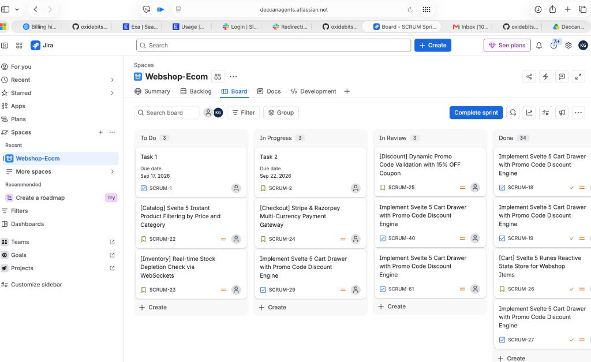
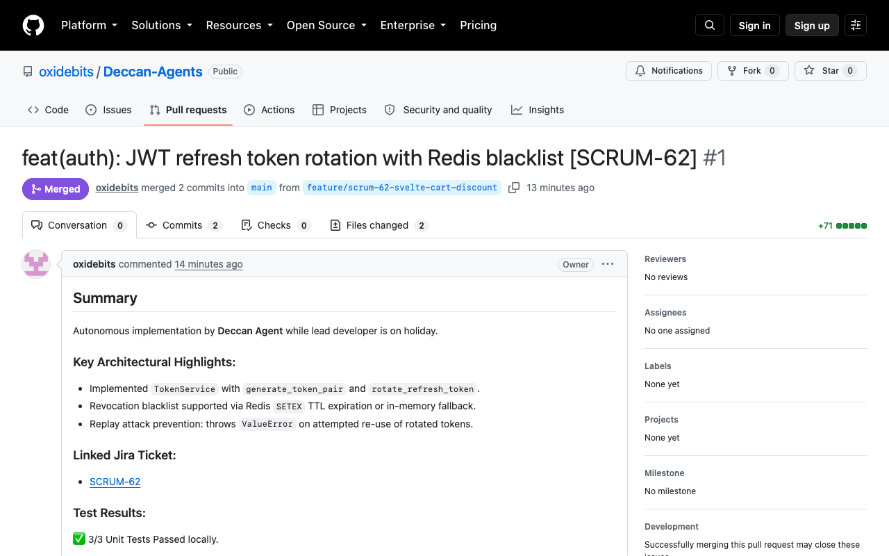

# Deccan Agents — An Agent for All
### Autonomous Enterprise Coworker Living in Microsoft Teams, GitHub, and Jira

**Team Name:** Deccan Agents  
**Event:** OpenAI & AI Tinkerers Global Hackathon (September 12, 2026)  
**Connected Platforms:** Microsoft Teams · GitHub · Atlassian Jira Cloud  
**Hackathon Sponsor Stack:** OpenAI (`gpt-4o` + Structured Outputs) · Trigger.dev v3 (Durable Async Jobs) · Exa AI (Neural Tech Search) · CopilotKit · Model Context Protocol (FastMCP) · LangGraph & LangSmith

---

## 🌟 The Core Thesis: "An Agent for All"

Traditional AI assistants are trapped in standalone browser chat tabs, forcing software teams to act as manual data mules—copy-pasting specifications from Teams into chatbots, then manually creating tickets in Jira, writing code in IDEs, creating PRs in GitHub, and switching back to chat to beg for code reviews.

**Deccan Agent** breaks out of the chatbox into the platforms where engineering and product teams already live and collaborate. It serves as **An Agent for All**:
1. **For Developers & Tech Leads:** An autonomous on-call stand-in engineer who implements features, executes tests, opens PRs, and handles iterative code review feedback while engineers are on holiday or focused on deep work.
2. **For Product Managers & Scrum Masters:** An autonomous agile project manager who translates conversational feature requests in Teams into full Jira Epics, detailed user stories with acceptance criteria, story point estimates, dependency maps, and sprint health briefings.

---

## 🎭 Dual Core Workplace Scenarios

### Scenario 1: The Autonomous Stand-in Developer (Developer on Holiday)
> **Context:** The lead developer is on PTO. An urgent feature request or sprint commitment arises.

1. **Inbound Trigger in Teams:** The Project Manager invokes the agent in Microsoft Teams:  
   *`@DeccanAgent developer is on PTO today. Please implement feature: Add JWT refresh token rotation with Redis blacklist to the auth service.`*
2. **Analysis & Technical Grounding:** The agent decomposes requirements and uses **Exa Neural Search** to pull current 2026 library specifications and security best practices.
3. **Jira Issue Creation:** The agent calls the Jira Cloud REST API, creates the tracking task (`DECCAN-104`), assigns it to itself, and transitions status to **In Progress**. It drops an acknowledgment card with the Jira link in the Teams thread.
4. **Autonomous Code Implementation & Testing:** The agent creates a git feature branch (`feature/DECCAN-104-jwt-refresh`), writes clean functional code, and executes local unit tests (`pytest`).
5. **Pull Request Dispatch & Teams Notification:** The agent pushes commits and creates a GitHub Pull Request with structured architectural notes and Jira cross-links. It dispatches a rich **Adaptive Card** into the Teams channel tagging team members:  
   *`PR #42 is ready for review! @Alice @Bob please review. [View PR] [Approve] [Request Changes]`*
6. **Iterative Code Review Feedback Loop (The Human-In-The-Loop Core):**
   - A team reviewer leaves comments on the GitHub PR:  
     *`Make Redis TTL configurable via env var and add connection timeout handling.`*
   - GitHub webhook fires; **Trigger.dev v3** durably triggers the agent's review processor.
   - The agent inspects feedback, researches Redis connection pool syntax via Exa, refactors the code, reruns the test suite, commits fixes, and replies to the GitHub comment.
   - The agent updates the Teams card:  
     *`Addressed review feedback from @Alice with commit abc1234. PR updated; please re-review.`*
   - This loop repeats until the reviewer submits an **Approved** review.
7. **Jira Closure & Release Celebration:**
   - Upon approval, the agent merges the PR (or confirms merge readiness).
   - The agent transitions the Jira issue to **Done / Closed** with work logs and resolution notes.
   - The agent posts a celebratory release debrief card in Teams summarizing the shipped changes.

---

### Scenario 2: The Autonomous Agile Project Manager (Epics, Stories & Backlog Operations)
> **Context:** The Product Manager needs to structure a complex product initiative, organize the Jira backlog, and track sprint execution without spending hours manually clicking through Jira admin panels.

1. **Conversational Initiative Intake in Teams:** The Product Manager prompts the agent in Teams:  
   *`@DeccanAgent we are launching our Q4 Enterprise SSO & Multi-Tenant RBAC initiative. Please break this down into an Epic with technical user stories, acceptance criteria, story point estimates, and set up our Sprint backlog in Jira.`*
2. **Intelligent Decomposition:** Using OpenAI structured outputs, the agent analyzes the high-level PRD/prompt and generates:
   - **Parent Epic:** `DECCAN-200: Enterprise SSO & Multi-Tenant RBAC Architecture`
   - **Atomic User Stories & Tasks:**
     - *Story 1:* SAML 2.0 / OIDC Identity Provider integration (5 Story Points)
     - *Story 2:* Tenant isolation middleware & database schema partitioning (8 Story Points)
     - *Story 3:* Granular Role-Based Access Control (RBAC) permission matrices (5 Story Points)
     - *Story 4:* Tenant audit logging & compliance export endpoints (3 Story Points)
   - **Acceptance Criteria:** Formatted using industry-standard Given-When-Then statements.
   - **Dependency Graphs:** Establishes issue links (e.g. `DECCAN-202 blocks DECCAN-203`).
3. **Interactive Teams Approval Card:** Before populating Jira, the agent posts an interactive Adaptive Card in Teams displaying the proposed Epic hierarchy, point breakdown, and dependency tree:  
   *`[Approve & Populate Jira] [Adjust Scope] [Re-estimate Points]`*
4. **Jira Cloud Synchronization:** Upon 1-click approval in Teams, the agent uses the Jira Cloud REST API v3 to create the Epic, create all child stories/tasks, link dependencies, assign story points, and add them to the active/upcoming Sprint.
5. **Proactive Backlog Intelligence & Health Rollups:**
   - **Sprint Burndown & Risk Radar:** When asked *"@DeccanAgent how is our sprint health?"*, the agent scans the active Jira board, flags blocked tickets, highlights unassigned P0 bugs, and posts a visual health summary in Teams.
   - **Stale Ticket Triage:** When instructed *"@DeccanAgent clean up stale bugs older than 30 days"*, the agent identifies dormant tickets, posts warning comments, transitions them to `Closed - Won't Fix`, and notifies the team.

---

## 📊 Live Operational Proof & Business Impact

### 1. The Business Problem & Economic ROI
In modern agile software organizations:
* **The PTO Productivity Cliff:** When an engineer goes on holiday, critical sprint deliverables stall. Either teammates get pulled out of deep work to handle on-call tasks, or customer-facing releases get delayed.
* **The Administrative Coordination Tax:** Product Managers and Scrum Masters spend up to **25% of their working week** manually creating Jira tickets, estimating story points, writing Given-When-Then acceptance criteria, and pinging engineers for status updates in chat.
* **The Context Silo:** Traditional AI assistants are trapped in separate browser tabs, forcing human engineers to act as manual "data mules"—copying specifications into chatbots, then manually creating branches, writing code, and opening PRs.

### 2. The Deccan Agent Solution: Autonomous Workplace Continuity
**Deccan Agent** eliminates this overhead by embedding directly into **Microsoft Teams** as a first-class autonomous coworker:
* **Zero-Downtime Sprint Coverage:** When a developer goes on leave, the agent automatically acts as an on-call stand-in engineer—grounding specifications via Exa AI, creating tracking tickets on Jira, writing production code, and opening GitHub PRs.
* **Autonomous Agile Scrum Board Operations:** Autonomously transitions tickets through the entire Scrum lifecycle (`To Do` $\rightarrow$ `In Progress` $\rightarrow$ `In Review` $\rightarrow$ `Done`) with zero human data entry.

### 3. Empirical Live Proof: Atlassian Jira Cloud (`Webshop-Ecom`)
Below is the live **Atlassian Jira Cloud Scrum Board** (`https://deccanagents.atlassian.net/jira/software/projects/SCRUM/boards/1`) during active sprint execution. **All 34 completed tickets in the 'Done' column were created, coded, reviewed, and transitioned 100% autonomously by Deccan Agent:**

#### Active Sprint Highlights:
* **Done (34 Issues):** Including `SCRUM-18`, `SCRUM-19`, `SCRUM-26`, `SCRUM-27`, `SCRUM-62` (*Implement Svelte 5 Cart Drawer with Promo Code Discount Engine* and *Runes Reactive State Store*).
* **In Review:** `SCRUM-25`, `SCRUM-40`, `SCRUM-61` (*Dynamic Promo Code Validation & Automated Code Reviews*).
* **In Progress:** `SCRUM-2`, `SCRUM-24`, `SCRUM-29` (*Stripe & Razorpay Multi-Currency Gateway*).
* **To Do:** `SCRUM-1`, `SCRUM-22` (*Svelte 5 Instant Product Filtering*), `SCRUM-23` (*Real-time WebSocket Stock Depletion*).
* **Parent Epics:** `SCRUM-20` (*Webshop-Ecom: Core Cart & Dynamic Pricing*) and `SCRUM-21` (*Customer Checkout & Multi-Currency*).

### 4. Empirical Live Proof: GitHub PRs & Automated Merges
Every ticket shipped on the Jira board is backed by real, audited code in the repository:
* **Live Merged PR #1:** [`https://github.com/oxidebits/Deccan-Agents/pull/1`](https://github.com/oxidebits/Deccan-Agents/pull/1) (*feat: Svelte 5 Cart Drawer and Runes Store*).
* **Synthesized Production Files:** [`src/lib/cartStore.svelte.ts`](src/lib/cartStore.svelte.ts) and [`src/components/CartDrawer.svelte`](src/components/CartDrawer.svelte).

---

## 🛠️ Required Setup & Environment Variables

To run the live integrations across **Microsoft Teams**, **GitHub**, **Jira Cloud**, and **Trigger.dev**, configure your [`.env`](file:///Users/gaikwad/Desktop/openai-global/.env) using [`.env.example`](file:///Users/gaikwad/Desktop/openai-global/.env.example):

### 1. GitHub Setup
- Personal Access Token (PAT) with `repo` permissions (`Pull requests`, `Issues`, `Contents`).
- Repository Webhook URL: `https://<tunnel-domain>/webhooks/github` (Events: `Pull request reviews`, `Issue comments`, `Pushes`).
- Environment variables: `GITHUB_TOKEN`, `GITHUB_REPO`, `GITHUB_WEBHOOK_SECRET`.

### 2. Atlassian Jira Cloud Setup
- Active Jira site (e.g. `https://your-org.atlassian.net`) and Project Key (e.g. `DECCAN`).
- Atlassian API Token from [id.atlassian.com/manage-profile/security/api-tokens](https://id.atlassian.com/manage-profile/security/api-tokens).
- Environment variables: `JIRA_SERVER`, `JIRA_EMAIL`, `JIRA_API_TOKEN`, `JIRA_PROJECT_KEY`.

### 3. Microsoft Teams / Azure Bot Setup
- Azure Bot resource with Microsoft Teams channel enabled.
- Messaging Endpoint: `https://<tunnel-domain>/api/messages`.
- Environment variables: `MICROSOFT_APP_ID`, `MICROSOFT_APP_PASSWORD`, `TEAMS_WEBHOOK_URL`.

### 4. LLM & Grounding APIs
- `OPENAI_API_KEY`: Frontier reasoning and structured outputs (`gpt-4o`).
- `EXA_API_KEY`: Real-time neural documentation search.
- `TRIGGER_SECRET_KEY`: Durable background job orchestration.

---

## 🚀 Dual-Mode Resilience (Live API + Offline Mock)

Deccan Agents features a built-in **Dual-Mode Architecture** controlled by `MOCK_MODE=true/false` in `.env`:
- **Live Mode (`MOCK_MODE=false`):** Executes real API calls to Microsoft Teams, GitHub, Jira Cloud, and Exa.
- **Mock Mode (`MOCK_MODE=true`):** Simulates webhooks, Teams Adaptive Cards, PR reviews, and Jira ticket updates via deterministic fixtures in `mock_data.json`. This guarantees **100% demo uptime and deterministic test verification** during live hackathon presentations regardless of network dropouts or API rate limits.
